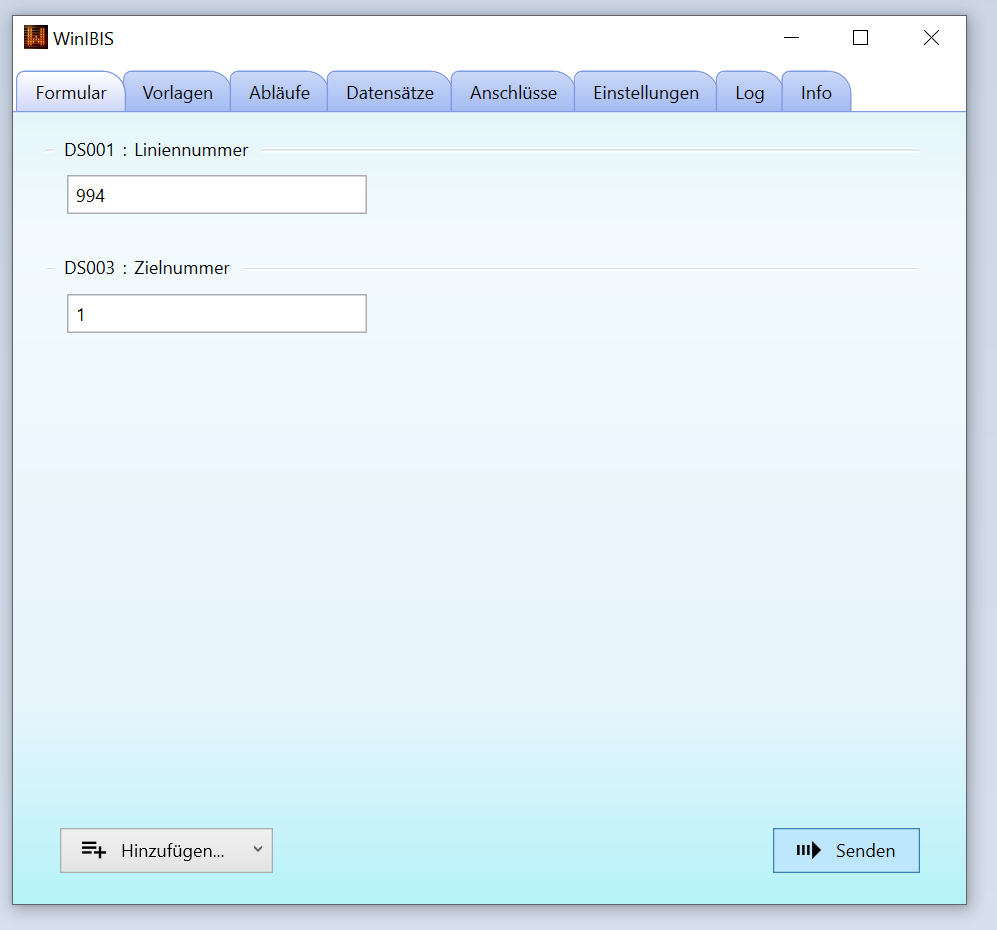
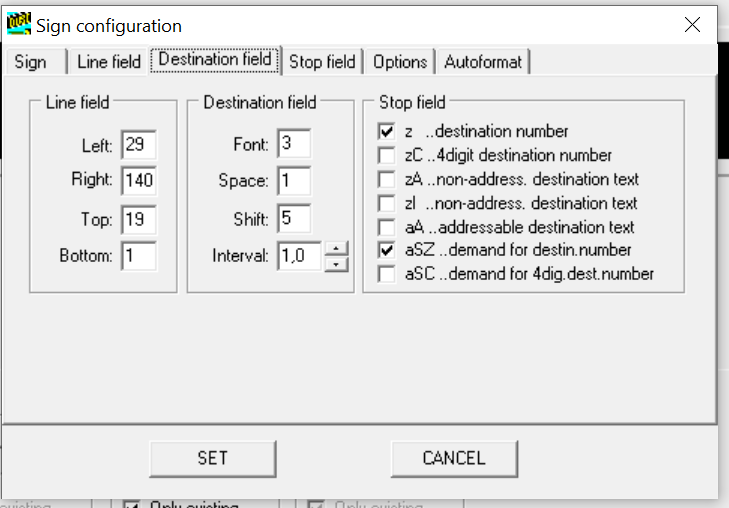
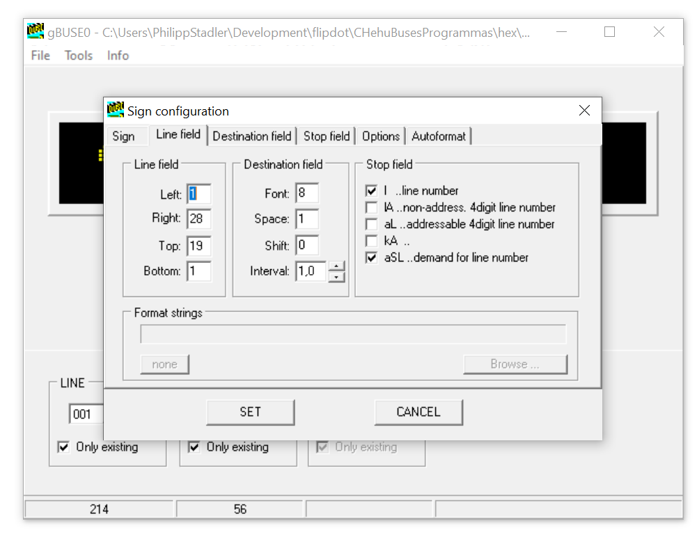
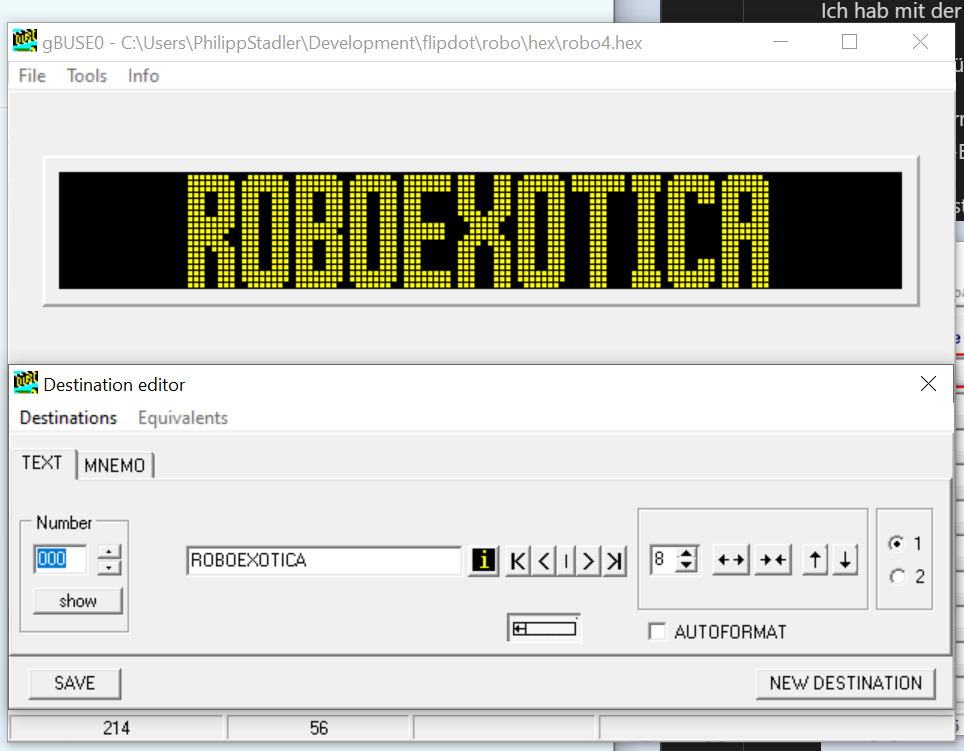
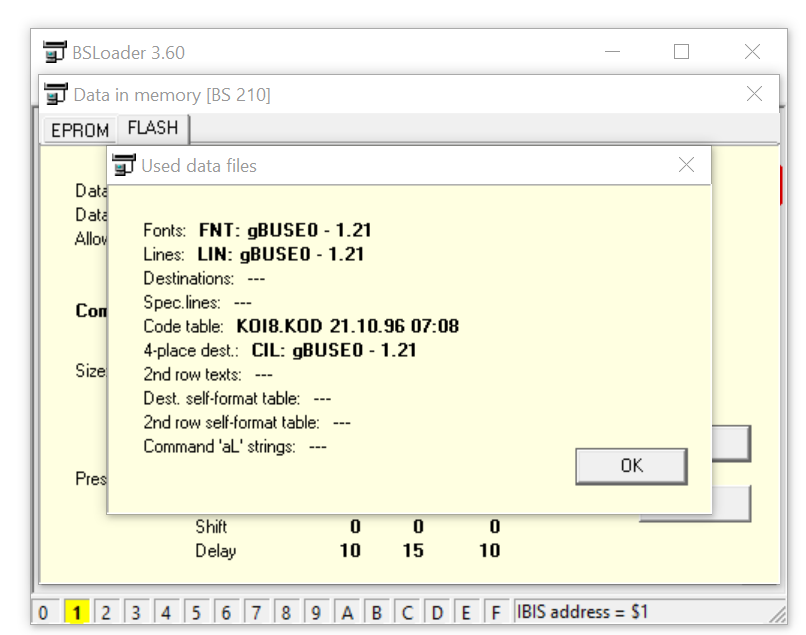
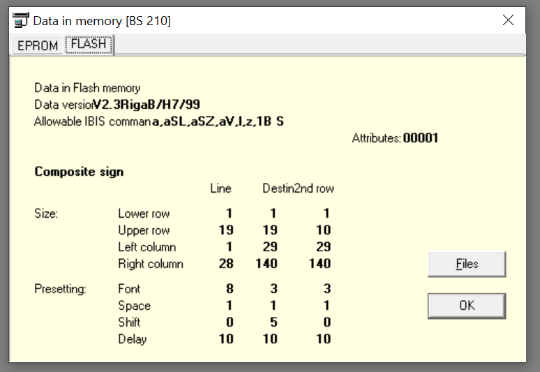
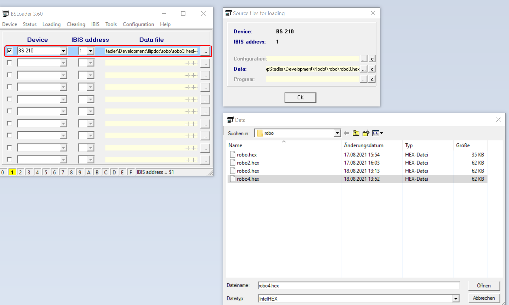
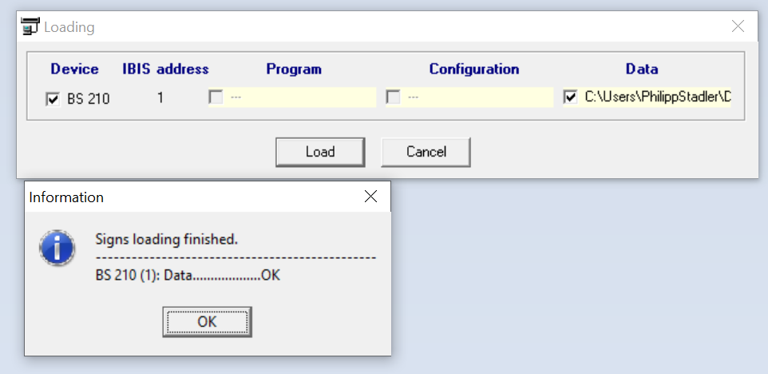

# BS210: Texte flashen und wechseln
Dieses Dokument erkärt wie man Texte auf das Buse BS210 Flipdot-Display flasht und welche Befehle verwendet werden können um zwischen den geflashten Texten zu wechseln.

## Texte wechseln
Texte lassen sich automatisiert gut mit `IBISSerial` wechseln, für die menschliche Benutzung funktionert _WinIBIS_ sehr gut.

### IBISSerial
DS001 für Liniennummer:
```
:: Liniennummer 111
IBISserial COM5 l111
```

Es gibt auch funky "Linien" zB ein Warnschild:
```
:: Liniennummer Warnschild
IBISserial COM5 l964
```

DS003 für Destination-Text. Welcher Text angezeigt wird, hängt von der geflashten Datenbank ab.
Mit `robo4.hex` zeigt folgendes "ROBOEXOTICA" ohne Liniennummer an:
```
:: Set destination text to destination #1
IBISserial COM5 z001
```

### WinIBIS
In _Datensätze_ DS001 für Liniennummer und DS003 für Zielnummer aktivieren.

In Formular gibt es dann für jeden Datensatz ein Textfeld, und mit dem _Senden_-Button sprechen wir unser BS210 an und setzen die Texte:


## Texte flashen
Mit `gBUSE0` lassen sich Ziel-Datenbanken erstellen und mit dem `BSLoader` kann man sie hochladen.

###  gBUSE0
Liest und generiert `.hex` für BS100 Bordcomputer.

Das Schild kann dieses Format verarbeiten wenn man die Datenbank im BSLoader flasht.

#### Aktive Datensätze
Man kann Datensätze auswählen bzw. aktivieren/deaktivieren:

Datensätze für "Ziel":



Datensätze für "Linie":



Ich habe noch keinen Weg gefunden wie das Schild diese Einstellungen wirklich übernimmt. Unabhängig von den Häkchen hier scheinen nur DS001 und DS003 zu funktionieren.

#### Texte ändern
Ich hab mit der existierenden Datei `CHehuBusesProgrammas/hex/1.bin` gestartet über _File | Open..._.

Linien ändern über _Tools | Line Editor_, das ist die  Zahl links. Es gibt auch Flugzeuge, Warnschilder, etc., und hier könnte man sie ändern.

Zieltexte ändern über _Tools | Destination Editor_. Links die "Number" auswählen für die man den Text ändern möchte, dann ins Textfild rechts daneben tippen. Wichtig: _SAVE_-Button drücken bevor man die "Number" wchselt, sonst gehen die Daten wieder verloren.

Beispiel im Destination Editor:


Über _File | Save as..._ kann man die `.hex`-Datenbank rausspielen, das man später mit _BSLoader_ auf das Gerät flasht.

### Uploaden mit BSLoader
Erkennt BS210 und man kann data files hochladen. Configuration und Program ist ausgegraut und kann nicht hochgeladen werden.

Es erwartet "Intel Hex" mit Datei-Endung `.hex` für Daten.

Das genaue Datenbankformat hängt von der verwendeten Hardware ab, für unseren BS210 brauchen wir das von gBUSE0 generierte Format.

Kann auch Infos über das BS210 auslesen:





Zum Flashen auf die 3 Punkte rechts drücken und _Data_ ersetzen im Dialog der aufpoppt:


Anschließend in der Menüleiste auf _Loading_ drücken un d mit Klick auf _Load_ den Upload starten:


## Nicht für BS210 geeignet: gBUSE1
Klingt ähnlich wie gBUSE0 und schaut gleich aus.

Generierte Datenbanken haben das falsche Format für das BS210-Schild.

Wenn man versucht sie im BSLoader zu flashen, kommt eine Warnung, dass das Format nicht übereinstimmt.