# Hex Files für Robo Exotica
Beschreibungen für die `*.hex` files in `hex`, neueste zuerst.

## robo11.hex
Line 100: Robo
Line 101: Cocktailglas
Line 102: Robo+Cocktailglas
Line 103: Cocktailglas+Robo
Line 104: 2 x Robo
Line 105: 2 x Cotkailglas
Line 106: Blank

### Destination 0
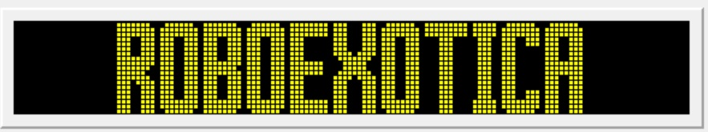

### Destination 1
Für September 9-11

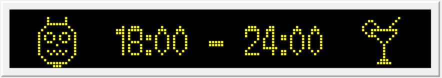

### Destination 2
Für September 10

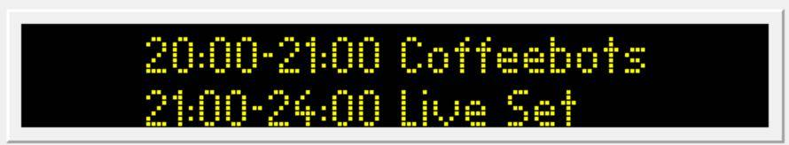

### Destination 3
Für September 10

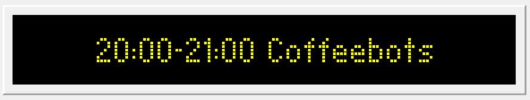

### Destination 4
Für September 10

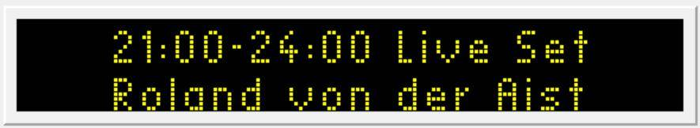

### Destination 5
Für September 9

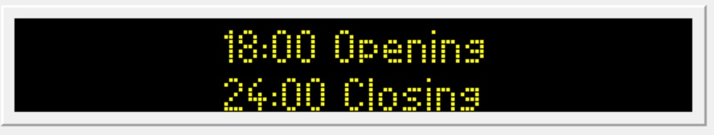

### Destination 6
Für September 9

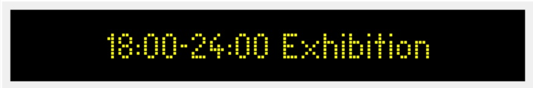

### Destination 7
Für September 11

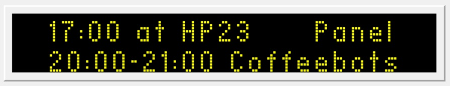

### Destination 8
Für September 11

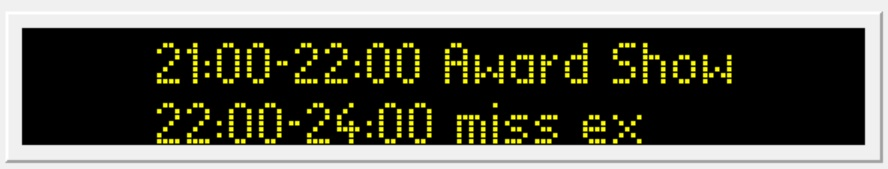

### Destination 9
Für September 10 und 11
Glyphe für 6 fehlt.

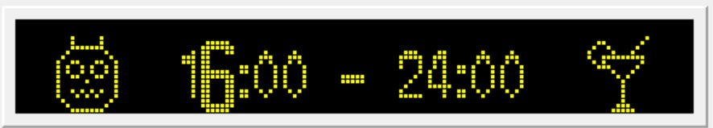

### Destination 10
Für September 9-11

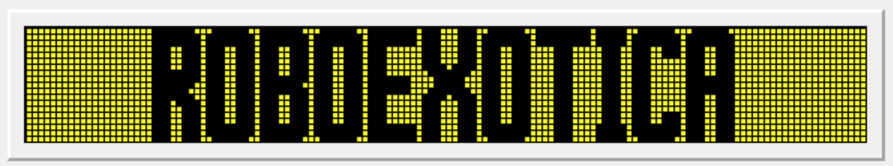

### Destination 11
Für September 10-11

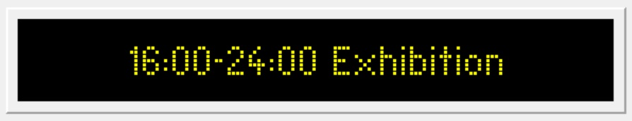

### Destination 12
Für September 10-12 (Nacht)

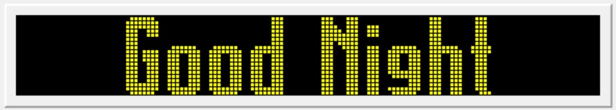

### Destination 13
Für September 10-12 (Nacht)

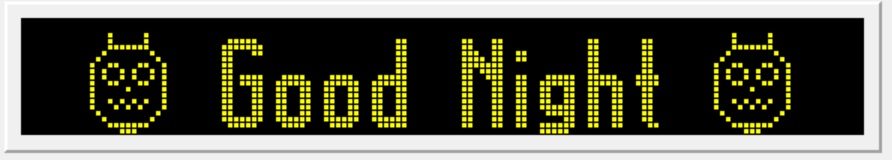

### Destination 14
Für September 10-12 (Nacht)

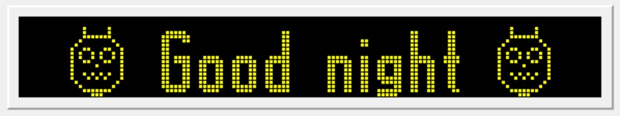

### Destination 15
Für September 10-12 (Nacht)

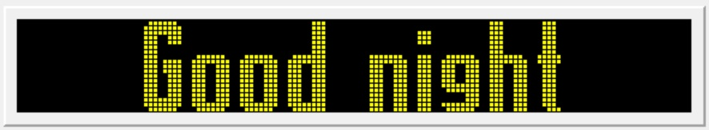

### Destination 16
Für September 10-12 (Nacht)

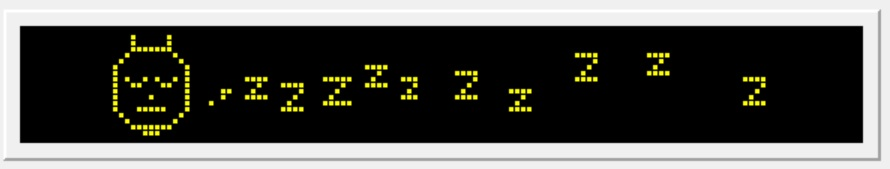

### Destination 17
Für vor dem Event

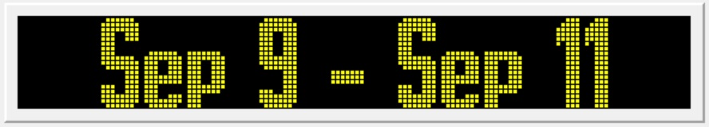

### Schriftanpassungen
Betrifft nur Größe / Font number 6:
Die Glyphen für :, 0, 1, 2, 4, 8 sind nach dem Bitmap in `bitmaps/zeitspanne.gif` nachgezeichnet.
Glyph 94 (^) ist ein Robo mit geschlossenen Augen
Glyph 96 (`) sind schlafmäßige zzzz
Glyph 172 (¬) ist ein besser nachgezeichneter Robo.
Glyph 174 (®) ist ein Cocktailglas.
Glyph 193 ({) sind noch mehr kleinere schlafmäßige zzzz mit extra Abstand am Anfang

Beide Glyphen sind nur für Schriftgröße 6 definiert und haben oben 2 freie Pixelreihen, nach unten schließen sie im Schild ab.

## robo10.hex
Line 100: Robo
Line 101: Cocktailglas
Line 102: Robo+Cocktailglas
Line 103: Cocktailglas+Robo
Line 104: 2 x Robo
Line 105: 2 x Cotkailglas
Line 106: Blank

### Destination 0

### Destination 1
Für September 9-11

### Destination 2
Für September 10

### Destination 3
Für September 10

### Destination 4
Für September 10

### Destination 5
Für September 9

### Destination 6
Für September 9

### Destination 7
Für September 11

### Destination 8
Für September 11

### Destination 9
Für September 10 und 11
Glyphe für 6 fehlt.

### Destination 10
Für September 9-11

### Destination 11
Für September 10-11

### Destination 12
Für September 10-12 (Nacht)

### Destination 13
Für September 10-12 (Nacht)

### Destination 14
Für September 10-12 (Nacht)

### Destination 15
Für September 10-12 (Nacht)

Die Glyphen für :, 0, 1, 2, 4, 8 sind nach dem Bitmap in `bitmaps/zeitspanne.gif` nachgezeichnet.
Glyph 172 (¬) ist ein besser nachgezeichneter Robo.
Glyph 174 (®) ist ein Cocktailglas.

Beide Glyphen sind nur für Schriftgröße 6 definiert und haben oben 2 freie Pixelreihen, nach unten schließen sie im Schild ab.

Destination 1 sieht ca. so aus:

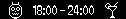

## robo9.hex
Line 100: Robo
Line 101: Cocktailglas
Line 102: Robo+Cocktailglas
Line 103: Cocktailglas+Robo
Line 104: 2 x Robo
Line 105: 2 x Cotkailglas
Line 106: Blank

Destination 0: ROBOEXOTICA
Destination 1: ist Zeitspannenangabe mit Robo und Cocktailglas
Destination 2: Coffeebots 20:00 - 21:00 (Platz für Linie)
Destination 3: Coffeebots 20:00 - 21:00 (fancy zahlen)
Destination 4: Panel 17:00-18:00, Coffeebots 20:00-21:00
Destination 5: ACRA Awards 21:00-22:00, Missex 22:00-23:00

Die Glyphen für :, 0, 1, 2, 4, 8 sind nach dem Bitmap in `bitmaps/zeitspanne.gif` nachgezeichnet.
Glyph 172 (¬) ist ein besser nachgezeichneter Robo.
Glyph 174 (®) ist ein Cocktailglas.

Beide Glyphen sind nur für Schriftgröße 6 definiert und haben oben 2 freie Pixelreihen, nach unten schließen sie im Schild ab.

Destination 1 sieht ca. so aus:

## robo8.hex
Line 100: Robo
Line 101: Cocktailglas
Line 102: Robo+Cocktailglas
Line 103: Cocktailglas+Robo
Line 104: 2 x Robo
Line 105: 2 x Cotkailglas

Destination 0: ROBOEXOTICA
Destination 1: ist Zeitspannenangabe mit Robo und Cocktailglas
Destination 2: Coffeebots 20:00 - 21:00 (Platz für Linie)
Destination 3: Coffeebots 20:00 - 21:00 (fancy zahlen)
Destination 4: Panel 17:00-18:00, Coffeebots 20:00-21:00
Destination 5: ACRA Awards 21:00-22:00, Missex 22:00-23:00

Die Glyphen für :, 0, 1, 2, 4, 8 sind nach dem Bitmap in `bitmaps/zeitspanne.gif` nachgezeichnet.
Glyph 172 (¬) ist ein besser nachgezeichneter Robo.
Glyph 174 (®) ist ein Cocktailglas.

Beide Glyphen sind nur für Schriftgröße 6 definiert und haben oben 2 freie Pixelreihen, nach unten schließen sie im Schild ab.

Destination 1 sieht ca. so aus:

## robo7.hex
Destination 0 ist ROBOEXOTICA
Destination 1 ist Zeitspannenangabe

Die Glyphen für :, 0, 1, 2, 4, 8 sind nach dem Bitmap in `bitmaps/zeitspanne.gif` nachgezeichnet.
Glyph 172 (¬) ist ein besser nachgezeichneter Robo.
Glyph 174 (®) ist ein Cocktailglas.

Beide Glyphen sind nur für Schriftgröße 6 definiert und haben oben 2 freie Pixelreihen, nach unten schließen sie im Schild ab.

Destination 1 sieht ca. so aus:

## robo6.hex
Destination 0 ist ROBOEXOTICA
Destination 1 ist Zeitspannenangabe

Glyph 172 (¬) ist ein besser nachgezeichneter Robo.
Glyph 174 (®) ist ein Cocktailglas.

Beide Glyphen sind nur für Schriftgröße 6 definiert und haben oben 2 freie Pixelreihen, nach unten schließen sie im Schild ab.

## robo5.hex
Ähnlich wie die letzten, aber mit einem Robogesicht-Test auf Destination 7.

Glyph 172 ist ein schlecht nachgezeichneter Robo.

## robo4.hex
Destination 0 ist ROBOEXOTICA ohne Liniennummer.
Destination 1 ist ROBOEXOTICA mit Liniennummer.

## robo3.hex
Von Anna verbesserte Version.

Line 000

Destination 0 ist Roboexotica
Destination 1 ist ROBOEXOTICA

Spätere destinations haben mit Kuchen und/oder WCs und raven zu tun.

## robo2.hex
Richtiges Format (gBuse0)

Datenbank mit Roboexotica in

Line 000

Destination 0 ist Roboexotica
Destination 1 ist ROBOEXOTICA

## robo.hex
Datenbank mit Roboexotica in

Line 000
Destination 000
Stop 0001

Destination 0 ist Roboexotica
Destination 1 ist ROBOEXOTICA
